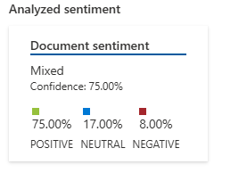
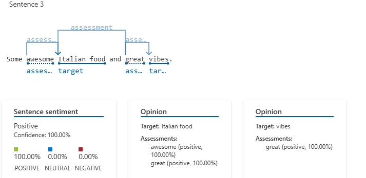

# Análise de Sentimento

## 1. Sentença Original

Long waits...BUT FOR GOOD REASON. Some awesome Italian food and great vibes. Contoso Bistro always has live music or events going on to keep you entertained. The food is good enough to keep me entertained though! The Contoso Bistro lasagna is a classic! The outdoor back patio is such a vibe, especially in the summer. Great service as well :) Love this place and will be back for more.

### Resultado



- **Sentimento geral:** `mixed` (misto)
- **Confiança:** `75%`
- **Positivo:** `17%`
- **Neutro/Negativo:** `8%`

**Comentário:**  
O modelo considerou o texto como misto porque, apesar de haver muitos elogios e palavras positivas (“awesome Italian food”, “great vibes”), há também menções potencialmente negativas ou neutras (“Long waits...”). Esse contraste faz com que o resultado global seja misto, já que existem elementos que indicam tanto satisfação quanto frustração ou espera prolongada.

---

## 1.1 Sentença 3



**Comentário:**  
Já aqui, a análise se concentrou em uma única frase (ou em um trecho mais curto) com destaque para “awesome Italian food” e “great vibes”. Essa frase isolada não apresenta termos negativos, resultando em um sentimento 100% positivo.
Aspectos identificados: O modelo de análise de sentimento conseguiu extrair alvos (“Italian food”, “vibes”) e relacioná-los a adjetivos (“awesome”, “great”), ambos com conotação positiva.

## 2. Análise de texto extraido de imagem

Na pasta `inputs` está a imagem utilizada para extração do texto. Essa imagem contém uma tabela com os nomes dos katas e seus respectivos valores, seguindo o padrão:

- Nome do kata (ex.: **HEIAN SHODAN**, **HEIAN NIDAN**, etc.)
- Informações padronizadas: `Original 15 Forms (•)`, `1st Kiai`, `2nd Kiai`, `3rd Kiai` e `Count`

## 2.1 Resultado do OCR

Na pasta `output`, o texto extraído utilizando o Microsoft Copilot foi salvo. O resultado obtido foi:

```plaintext
KATA

SHITEI GATA

HEIAN SHODAN: Original 15 Forms (•), 1st Kiai (9), 2nd Kiai (17), 3rd Kiai (21), Count (21)

HEIAN NIDAN: Original 15 Forms (•), 1st Kiai (11), 2nd Kiai (26), 3rd Kiai (26), Count (26)

HEIAN SANDAN: Original 15 Forms (•), 1st Kiai (10), 2nd Kiai (20), 3rd Kiai (20), Count (20)

HEIAN YONDAN: Original 15 Forms (•), 1st Kiai (13), 2nd Kiai (25), 3rd Kiai (27), Count (27)

HEIAN GODAN: Original 15 Forms (•), 1st Kiai (12), 2nd Kiai (23), 3rd Kiai (23), Count (23)

TEKKI SHODAN: Original 15 Forms (•), 1st Kiai (15), 2nd Kiai (29), 3rd Kiai (29), Count (29)

SENTEI GATA

BASSAI DAI: Original 15 Forms (•), 1st Kiai (19), 2nd Kiai (42), 3rd Kiai (42), Count (42)

KANKU DAI: Original 15 Forms (•), 1st Kiai (15), 2nd Kiai (65), 3rd Kiai (65), Count (65)

EMPI: Original 15 Forms (•), 1st Kiai (15), 2nd Kiai (36), 3rd Kiai (37), Count (37)

JION: Original 15 Forms (•), 1st Kiai (17), 2nd Kiai (47), 3rd Kiai (47), Count (47)

TEKKI NIDAN: Original 15 Forms (•), 1st Kiai (12), 2nd Kiai (24), 3rd Kiai (24), Count (24)

TEKKI SANDAN: Original 15 Forms (•), 1st Kiai (16), 2nd Kiai (36), 3rd Kiai (36), Count (36)

JITTE: Original 15 Forms (•), 1st Kiai (13), 2nd Kiai (24), 3rd Kiai (24), Count (24)

HANGETSU: Original 15 Forms (•), 1st Kiai (14), 2nd Kiai (41), 3rd Kiai (41), Count (41)

GANKAKU: Original 15 Forms (•), 1st Kiai (28), 2nd Kiai (42), 3rd Kiai (42), Count (42)

JIYU GATA

BASSAI SHO: Original 15 Forms (•), 1st Kiai (17), 2nd Kiai (22), 3rd Kiai (22), Count (22)

KANKU SHO: Original 15 Forms (•), 1st Kiai (18), 2nd Kiai (48), 3rd Kiai (48), Count (48)

CHINTE: Original 15 Forms (•), 1st Kiai (28), 2nd Kiai (32), 3rd Kiai (32), Count (32)

UNSU: Original 15 Forms (•), 1st Kiai (36), 2nd Kiai (48), 3rd Kiai (48), Count (48)

SOCHIN: Original 15 Forms (•), 1st Kiai (24), 2nd Kiai (48), 3rd Kiai (48), Count (48)

NIJUSHIHO: Original 15 Forms (•), 1st Kiai (18), 2nd Kiai (33), 3rd Kiai (33), Count (33)

GOJUSHIHO DAI: Original 15 Forms (•), 1st Kiai (59), 2nd Kiai (66), 3rd Kiai (66), Count (66)
```
